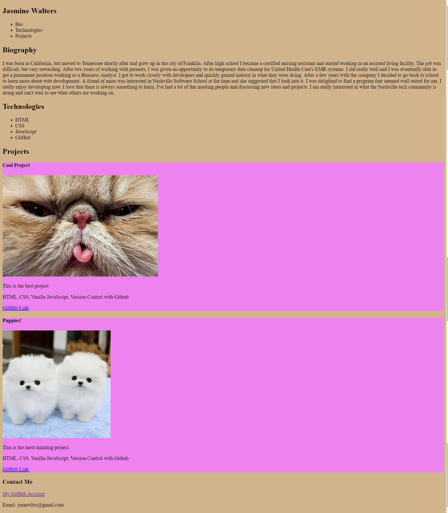

# personal-bio-site

This is my personal bio site. It is a site that hosts my main projects and tells others more about myself.

## How to run this project
* Use npm to install http-server in your terminal:
```sh
npm install -g http-server
```
* Run the server
```sh
hs -p 9999
```
* Open chrome and navigate to:
```
localhost:9999
```

## Screenshots

### Homepage

